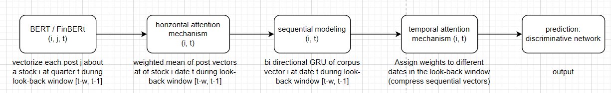

> paper: [Listening to Chaotic Whispers: A Deep Learning Framework for News-oriented Stock Trend Prediction](https://dl.acm.org/doi/abs/10.1145/3159652.3159690)

**Pipeline Overview**
1. Data Collection

Reddit Data: r/wallstreetbets submissions and comments (2019-2024) from Academic Torrents
Earnings Data: Quarterly earnings history via Alpha Vantage API
Financial Data: Quarterly fundamentals from Compustat (optional enhancement)

2. Data Preprocessing

Ticker Extraction: Match posts to stocks using regex-based ticker detection
Temporal Alignment: Create 60-day lookback windows before each earnings announcement date
Daily Aggregation: Combine all posts about a stock per day into daily text sequences
Time-based Split: Train (2019-2022), Validation (2023), Test (2024)

3. Feature Engineering

Text Vectorization: FinBERT embeddings for each day's aggregated text
Sequence Construction: 60-day sequences for each earnings event
Labels: classification (positive v. negative earnings surprise)

4. Model Architecture

BERT Embeddings: Domain-specific financial language model (FinBERT)
Sequential Modeling: Bi-directional GRU processes
Temporal Attention: Learns which days matter most for prediction
Prediction Head: Dense layers output earnings surprise probability

5. Evaluation: tbd

**Tech Stack**

1. Data & Preprocessing

Pandas, NumPy: Data manipulation
fuzzywuzzy: Ticker matching
Transformers (Hugging Face): FinBERT embeddings

2. Deep Learning

PyTorch: Neural network framework
Custom HAN architecture: GRU + Attention mechanisms

**Resources**

1. Academic Torrents: https://academictorrents.com/details/ba051999301b109eab37d16f027b3f49ade2de13 
2. Alpha Vantage API: https://www.alphavantage.co/documentation/ (Earnings endpoint) 
3. FinBERT: ProsusAI/finbert (Hugging Face)

**Results**

Average Loss: 0.6782 \
Overall Accuracy: 60.5697% \
Risk Precision: 0.5842 \
Risk Recall: **0.7331** \
Risk F1-Score: 0.6503 

Detailed Classification Report:

              precision    recall  f1-score
              
    Safe (0)     0.6419    0.4783    0.5481
    Risk (1)     0.5842    0.7331    0.6503
    accuracy                         0.6057 
